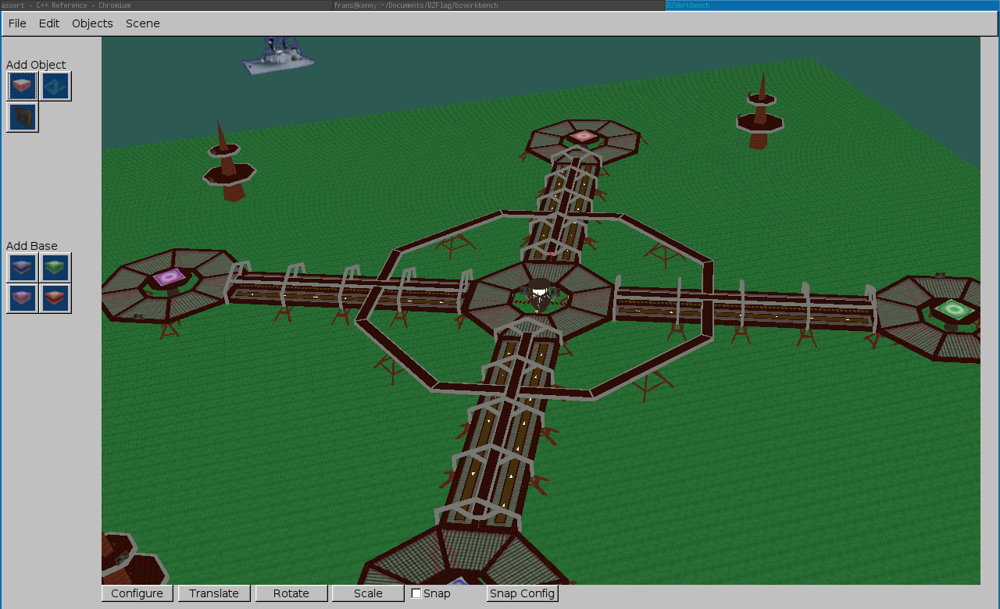

#BZWorkbench

BZWorkbench is a full featured world editor for the game BZFlag. For the game see <http://www.BZFlag.org>.

This fork is an attempt to get it working again and develop it further under
modern versions of Linux.

It was initaly written for the google summer of code program.

In its current state it:

- compiles under Arch Linux
- Can load and view maps

You can rotate the map by using the pressing the left mouse
button and moving the mouse on the screen. Using mouse+ctrl or
mouse+alt, you can shift or scale the map.

